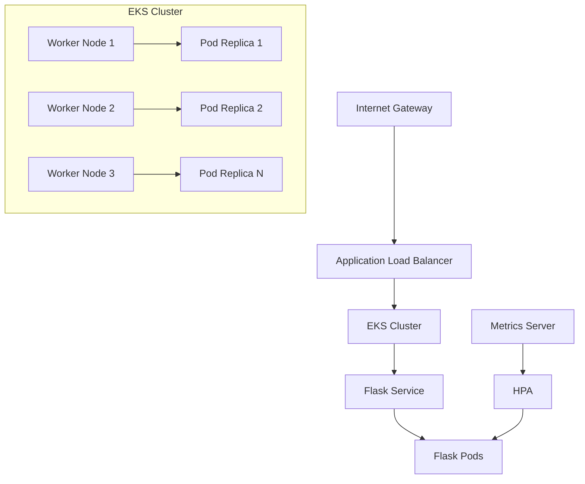

# Python Flask Application Deployment on Amazon EKS

[](https://aws.amazon.com/eks/)
[](https://kubernetes.io/)
[](https://python.org/)
[](https://flask.palletsprojects.com/)
[](https://opensource.org/licenses/MIT)

A comprehensive guide to deploying a production-ready Python Flask application on Amazon Elastic Kubernetes Service (EKS). This project demonstrates containerization, Kubernetes deployment patterns, and AWS cloud-native best practices.

## 🚀 Quick Start

```bash
# Clone the repository
git clone https://github.com/ibraheemcisse/Python-Application-Deployment-on-Amazon-Elastic-Kubernetes-Service-EKS-.git
cd Python-Application-Deployment-on-Amazon-Elastic-Kubernetes-Service-EKS-

# Create EKS cluster
eksctl create cluster -f cluster-config.yaml

# Deploy the application
kubectl apply -f k8s/

# Get external IP and access your app
kubectl get svc flask-service -n flask-app
```

## 📋 Table of Contents

- [Overview](#-overview)
- [Architecture](#-architecture)
- [Features](#-features)
- [Prerequisites](#-prerequisites)
- [Installation & Setup](#-installation--setup)
- [Configuration](#-configuration)
- [Deployment](#-deployment)
- [Accessing the Application](#-accessing-the-application)
- [Monitoring & Scaling](#-monitoring--scaling)
- [Security](#-security)
- [Troubleshooting](#-troubleshooting)
- [Best Practices](#-best-practices)
- [Contributing](#-contributing)
- [License](#-license)

## 🎯 Overview

This project showcases a production-ready deployment of a Python Flask application on Amazon EKS, demonstrating:

- **Container Best Practices**: Multi-stage Docker builds with security hardening
- **Kubernetes Patterns**: Proper resource management, health checks, and scaling
- **AWS Integration**: EKS cluster configuration with managed node groups
- **Production Readiness**: Security contexts, resource limits, and monitoring

### Key Features

- ✅ **High Availability**: Multiple replicas with proper distribution
- ✅ **Auto Scaling**: Horizontal Pod Autoscaler based on CPU/memory
- ✅ **Security**: Non-root containers with security contexts
- ✅ **Monitoring**: Health checks and resource monitoring
- ✅ **Production Ready**: Resource limits, proper networking, and error handling

## 🏗 Architecture



### Component Overview

| Component | Purpose | Configuration |
|-----------|---------|---------------|
| Flask Application | Python web service | Port 5000, health endpoints |
| EKS Cluster | Kubernetes orchestration | v1.26+, managed node groups |
| Load Balancer | External traffic distribution | AWS ALB/NLB integration |
| Auto Scaler | Dynamic scaling | CPU/memory based triggers |

## 📦 Prerequisites

### Required Tools

Ensure you have these tools installed:

| Tool | Version | Installation Guide |
|------|---------|-------------------|
| AWS CLI | v2.x+ | [Install AWS CLI](https://docs.aws.amazon.com/cli/latest/userguide/getting-started-install.html) |
| eksctl | v0.140+ | [Install eksctl](https://eksctl.io/installation/) |
| kubectl | v1.26+ | [Install kubectl](https://kubernetes.io/docs/tasks/tools/) |
| Docker | v20.x+ | [Install Docker](https://docs.docker.com/get-docker/) |

### AWS Requirements

- AWS Account with programmatic access
- IAM permissions for EKS, EC2, VPC, and LoadBalancer operations
- AWS CLI configured with appropriate credentials

```bash
# Verify AWS configuration
aws sts get-caller-identity
aws eks list-clusters
```

### System Requirements

- **Memory**: 4GB RAM minimum (8GB recommended)
- **CPU**: 2+ cores for local development
- **Storage**: 5GB available disk space
- **Network**: Reliable internet connection

## 🛠 Installation & Setup

### 1. Clone Repository

```bash
git clone https://github.com/ibraheemcisse/Python-Application-Deployment-on-Amazon-Elastic-Kubernetes-Service-EKS-.git
cd Python-Application-Deployment-on-Amazon-Elastic-Kubernetes-Service-EKS-

# Make scripts executable
chmod +x scripts/*.sh
```

### 2. Create EKS Cluster

Using the enhanced cluster configuration:

```bash
# Create cluster with optimized settings
eksctl create cluster -f cluster-config.yaml

# Verify cluster creation
kubectl get nodes
kubectl get pods --all-namespaces
```

### 3. Build Custom Image (Optional)

If you want to build your own image:

```bash
# Build the Docker image
docker build -t your-registry/flask-app:v1.0.0 .

# Push to your container registry
docker push your-registry/flask-app:v1.0.0

# Update deployment.yaml with your image
```

## ⚙️ Configuration

### Environment Variables

The Flask application supports these environment variables:

| Variable | Default | Description |
|----------|---------|-------------|
| `FLASK_ENV` | `production` | Flask environment (development/production) |
| `FLASK_DEBUG` | `False` | Enable/disable debug mode |
| `PORT` | `5000` | Port for the Flask application |
| `WORKERS` | `4` | Number of Gunicorn workers |

### Configuration Files

| File | Purpose |
|------|---------|
| `cluster-config.yaml` | EKS cluster specifications |
| `k8s/namespace.yaml` | Namespace isolation |
| `k8s/deployment.yaml` | Application deployment with best practices |
| `k8s/service.yaml` | Service exposure configuration |
| `k8s/hpa.yaml` | Horizontal Pod Autoscaler |
| `k8s/ingress.yaml` | Ingress controller configuration |

## 🚢 Deployment

### One-Command Deployment

```bash
# Apply all Kubernetes manifests
kubectl apply -f k8s/

# Verify deployment status
kubectl get all -n flask-app
```

### Step-by-Step Deployment

For granular control, deploy resources individually:

```bash
# 1. Create namespace
kubectl apply -f k8s/namespace.yaml

# 2. Deploy the application
kubectl apply -f k8s/deployment.yaml

# 3. Create service
kubectl apply -f k8s/service.yaml

# 4. Enable auto-scaling
kubectl apply -f k8s/hpa.yaml

# 5. Configure ingress (optional)
kubectl apply -f k8s/ingress.yaml
```

### Verify Deployment

```bash
# Check pod status
kubectl get pods -n flask-app

# Check service endpoints
kubectl get svc -n flask-app

# Check auto-scaler status
kubectl get hpa -n flask-app

# View application logs
kubectl logs -f deployment/flask-app -n flask-app
```

## 🌐 Accessing the Application

### External Access (Production)

```bash
# Get LoadBalancer external IP
kubectl get svc flask-service -n flask-app

# Wait for EXTERNAL-IP to be assigned (may take 2-3 minutes)
# Access at: http://<EXTERNAL-IP>
```

### Local Access (Development)

```bash
# Forward local port to service
kubectl port-forward svc/flask-service -n flask-app 8080:80

# Access at: http://localhost:8080
```

### Available Endpoints

- `GET /` - Application home page
- `GET /health` - Health check endpoint
- `GET /ready` - Readiness probe endpoint
- `GET /metrics` - Basic application metrics

## 📊 Monitoring & Scaling

### Auto Scaling

The HPA automatically scales pods based on resource usage:

```bash
# Check current scaling status
kubectl get hpa -n flask-app

# Watch scaling events
kubectl get events --sort-by=.lastTimestamp -n flask-app

# Monitor resource usage
kubectl top pods -n flask-app
kubectl top nodes
```

### Load Testing

Simple load test to trigger scaling:

```bash
# Install siege for load testing
# macOS: brew install siege
# Ubuntu: sudo apt-get install siege

# Run load test
siege -c 20 -t 2M http://<EXTERNAL-IP>
```

### Resource Monitoring

```bash
# View detailed pod information
kubectl describe pod <pod-name> -n flask-app

# Check cluster events
kubectl get events --sort-by=.lastTimestamp
```

## 🔒 Security

### Container Security
- ✅ Non-root user execution
- ✅ Read-only root filesystem
- ✅ Dropped capabilities
- ✅ Security context enforcement

### Network Security
- ✅ Namespace isolation
- ✅ Service-to-service communication
- ✅ LoadBalancer with AWS security groups

### Resource Security
- ✅ Resource limits and requests
- ✅ CPU and memory constraints
- ✅ Proper RBAC (future enhancement)

### Security Validation

```bash
# Scan for security vulnerabilities
kubectl auth can-i --list --as=system:serviceaccount:flask-app:default

# Check security contexts
kubectl get pods -n flask-app -o jsonpath='{.items[*].spec.securityContext}'

# Review resource limits
kubectl describe resourcequota -n flask-app
```

## 🔧 Troubleshooting

<details>
<summary><strong>Pods Not Starting</strong></summary>

```bash
# Check pod status and events
kubectl describe pod <pod-name> -n flask-app

# Common causes:
# - Image pull errors: Check image name and registry access
# - Resource constraints: Check node capacity
# - Configuration errors: Validate YAML syntax
```
</details>

<details>
<summary><strong>Service Not Accessible</strong></summary>

```bash
# Verify service configuration
kubectl get svc -n flask-app -o wide

# Check endpoints
kubectl get endpoints -n flask-app

# Test internal connectivity
kubectl run test-pod --image=busybox -i --tty --rm -- /bin/sh
# Inside pod: wget -qO- http://flask-service.flask-app.svc.cluster.local
```
</details>

<details>
<summary><strong>Auto Scaling Not Working</strong></summary>

```bash
# Check HPA status
kubectl describe hpa flask-app-hpa -n flask-app

# Verify metrics server
kubectl get deployment metrics-server -n kube-system

# Check resource usage
kubectl top pods -n flask-app
```
</details>

<details>
<summary><strong>LoadBalancer Issues</strong></summary>

```bash
# Check AWS LoadBalancer Controller
kubectl get pods -n kube-system | grep aws-load-balancer

# Verify service annotations
kubectl describe svc flask-service -n flask-app

# Check AWS console for LoadBalancer creation
```
</details>

### Debug Commands

```bash
# Get comprehensive cluster info
kubectl cluster-info dump

# Check all resources in namespace
kubectl get all -n flask-app

# View recent events
kubectl get events --sort-by=.lastTimestamp -n flask-app

# Export resource configurations
kubectl get deployment flask-app -n flask-app -o yaml > debug-deployment.yaml
```

## 💡 Best Practices

### Container Best Practices
- Multi-stage builds for smaller, secure images
- Non-root users for security
- Minimal base images to reduce attack surface
- Explicit versioning instead of `latest` tags

### Kubernetes Best Practices
- Resource limits and requests for proper scheduling
- Health checks for reliable deployments
- Namespace isolation for multi-tenancy
- ConfigMaps and Secrets for configuration management

### Production Recommendations
- Implement CI/CD pipeline for automated deployments
- Add monitoring with Prometheus/Grafana
- Set up centralized logging with Fluentd/ELK
- Configure backup and disaster recovery
- Implement GitOps with ArgoCD or Flux

## 🚀 Future Enhancements

- **Service Mesh**: Istio integration for advanced traffic management
- **GitOps**: ArgoCD for declarative deployments
- **Observability**: Prometheus, Grafana, and Jaeger integration
- **Security**: Pod Security Standards and Network Policies
- **Multi-environment**: Development, staging, and production configs
- **Database Integration**: PostgreSQL deployment example

## 🤝 Contributing

We welcome contributions! Here's how you can help:

1. **Fork** the repository
2. **Create** a feature branch: `git checkout -b feature/amazing-feature`
3. **Commit** your changes: `git commit -m 'Add amazing feature'`
4. **Push** to the branch: `git push origin feature/amazing-feature`
5. **Open** a Pull Request

### Areas for Contribution
- 📖 Documentation improvements
- 🔒 Security enhancements
- ⚡ Performance optimizations
- 🔧 Additional deployment patterns
- 🧪 Testing framework additions

## 📄 License

This project is licensed under the MIT License - see the [LICENSE](LICENSE) file for details.

## 🙏 Acknowledgments

- **Amazon EKS Team** for the excellent managed Kubernetes service
- **Kubernetes Community** for the robust orchestration platform
- **Flask Community** for the lightweight web framework
- **eksctl Contributors** for simplifying EKS cluster management

## 📞 Support

- **Documentation**: Check the `/docs` folder for detailed guides
- **Issues**: [GitHub Issues](https://github.com/ibraheemcisse/Python-Application-Deployment-on-Amazon-Elastic-Kubernetes-Service-EKS-/issues)
- **Discussions**: [GitHub Discussions](https://github.com/ibraheemcisse/Python-Application-Deployment-on-Amazon-Elastic-Kubernetes-Service-EKS-/discussions)

---

⭐ **If this project helps you learn Kubernetes and EKS, please give it a star!** ⭐
